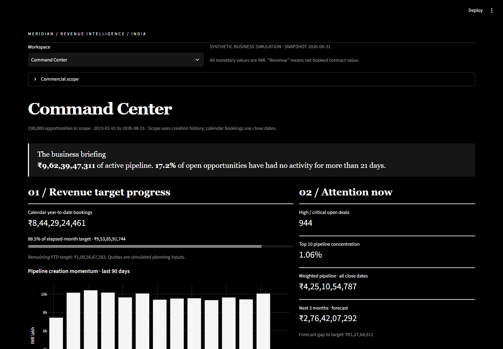
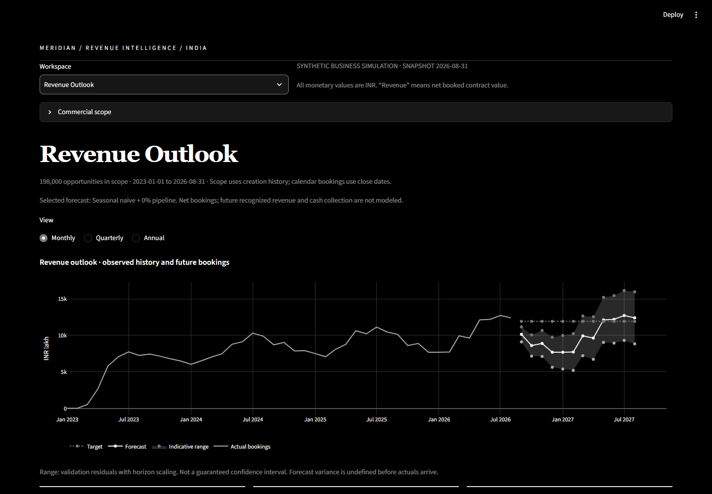
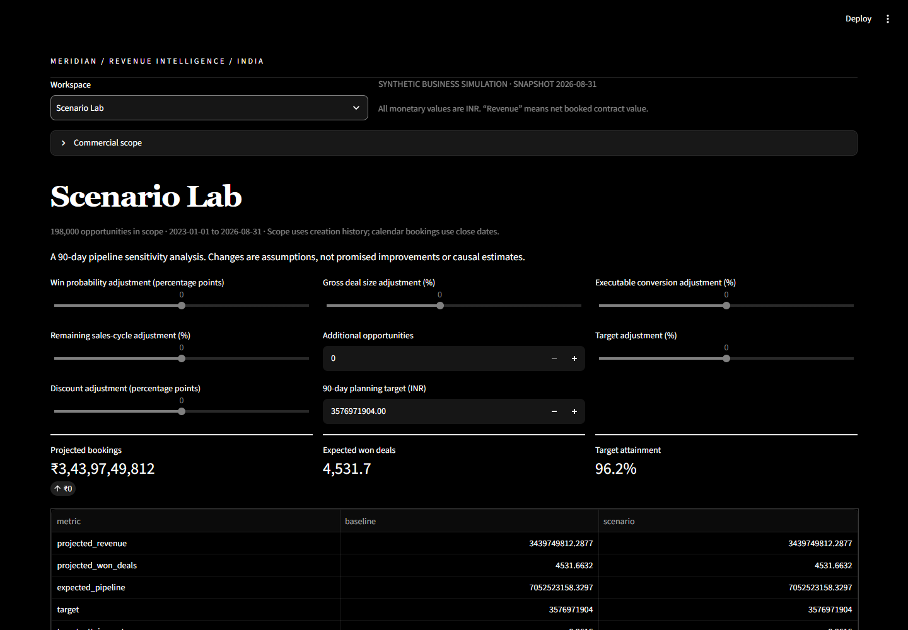
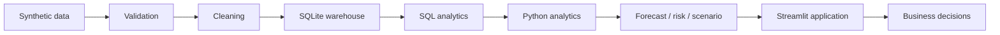

# MERIDIAN — Sales Pipeline & Revenue Forecasting Platform

A runnable India-focused revenue operations application connecting business requirements, SQL, pipeline diagnostics and forecast evidence to management decisions.

**All data in this project is synthetic and simulated for educational and portfolio purposes.**

## Business problem and objectives
Sales leaders need to understand pipeline health, stage bottlenecks, unpredictable closing dates and target gaps. MERIDIAN helps them decide which opportunities need attention and what future bookings may look like. It is positioned primarily as a **Business Analyst + BI + sales/revenue analytics** portfolio, not an ML showcase.

Key questions: Where does conversion break down? Which deals have no next action? Is expected revenue concentrated? How does forecast compare with quota? What assumptions would close the planning gap?

## Features and dashboard
- Black background, white text and grayscale charts across all workspaces.
- Editorial business briefing, pipeline stage lanes and recent movement.
- Forecast outlook with historical actuals, targets, indicative range and held-out error.
- Searchable/filterable opportunity desk, real event drill-down and complete CSV exports.
- Multi-dimensional sales performance, loss Pareto, cycle distributions and source uncertainty.
- Seven-input scenario laboratory and evidence-linked action queue.
- Data-quality audit, 42 executable business SQL queries and transparent scoring.





## Technology and architecture
Python 3.12, Pandas, NumPy, SQLite, Plotly, Streamlit, SciPy and pytest. No cloud service, key, container or paid dataset is required.



See [architecture and data model](docs/ARCHITECTURE.md), [business requirements](docs/BUSINESS_REQUIREMENTS.md), [30 user stories](docs/USER_STORIES.md), [as-is](docs/AS_IS_PROCESS.md) and [to-be](docs/TO_BE_PROCESS.md) process maps.

## Installation and exact commands
Install Python 3.12, then run from the repository root:

```powershell
python -m venv .venv
.venv\Scripts\Activate.ps1
python -m pip install -r requirements.txt
python run_pipeline.py
python -m pytest -q
python -m streamlit run app.py
```

On macOS/Linux activate using `source .venv/bin/activate`. If Windows has `py` rather than `python`, use `py -3.12 -m venv .venv` initially. Activation is optional: call `.venv\Scripts\python.exe` directly when PowerShell blocks activation.

Open **http://localhost:8501** in Chrome. The server binds only to this machine. The standard `streamlit run app.py` command also works after environment activation. Stop with Ctrl+C.

## Data and one-command pipeline
The default config generates 200,000 opportunity records before deliberate duplicates, plus customers, activities, stage visits, teams, accounts, products, targets and contracts. All amounts are INR. A fixed seed and a fixed 2026-08-31 snapshot make the run reproducible.

Change `dataset_size` in config/config.yaml or set an environment variable:

```powershell
$env:DATASET_SIZE = '200000'
python run_pipeline.py --regenerate
```

`run_pipeline.py` generates or loads raw Parquet, profiles defects, repairs/quarantines data, validates relationships, computes features/KPIs/funnel/risk/forecasts/scenarios, executes all SQL, atomically publishes SQLite and writes reports. Existing matching raw data is reused. Corrupt or changed synthetic inputs can be replaced with `--regenerate`; this intentionally replaces generated data. No Python source edits are needed.

The [data dictionary](docs/DATA_DICTIONARY.md) describes grains and fields. [Data quality report](DATA_QUALITY_REPORT.md) reports actual defect counts. Large raw/processed datasets and SQLite are gitignored and regenerated locally; a small CSV sample is included. Stage histories enable genuine transition analysis; current-stage counts alone are never used to infer conversion.

## KPI framework and SQL
The [KPI dictionary](docs/KPI_DICTIONARY.md) defines what, why, formula and interpretation for every core measure. Win rate uses resolved deals; pipeline includes active Open and Stalled; revenue means **net booked contract value**, not accounting-recognized revenue or cash.

The four SQL files answer 42 commercial questions with joins, CTEs, CASE, GROUP BY/HAVING, ROW_NUMBER, RANK, DENSE_RANK, LAG, LEAD, rolling windows, cohorts and exact median/nearest-rank percentiles. Every statement runs during publication. [SQL guide](docs/SQL_GUIDE.md) maps question IDs to files. Quota and bookings are aligned to date and organizational scope; unallocated product/segment quotas are not invented.

## Forecast, risk and scenario methodology
Compare MA3, SES and seasonal-naive history baselines, each with 0%, 25% or 50% weighted-pipeline contribution. Reconstruct historical cutoffs, select on six validation origins and evaluate on six later test origins. A history-only model may legitimately win. Display current pipeline separately so users can reconcile its timing with the statistical forecast.

Risk is a ten-rule policy score with explanations. Health has eight inspectable components. Neither is a calibrated probability. Scenario inputs change probabilities, size, execution, timing, added opportunity volume, targets and discounts with explicit bounds.

See [methodology](docs/METHODOLOGY.md), [business rules](docs/BUSINESS_RULES.md), [forecast evaluation](reports/forecast_evaluation.md), [statistical analysis](reports/statistical_analysis.md) and [calculated business insights](reports/business_insights.md). Exposure is never presented as recovered revenue.

## Actual results and validation
See [RESULTS.md](RESULTS.md) for the executed dataset, quality, KPI, forecast, risk and scenario results. [Validation evidence](docs/VALIDATION.md) records tests and browser checks; the run manifest records configuration and counts. Tests include numerical examples, invariants, temporal leakage checks and app interactions.

```powershell
python -m pytest -q
python -m ruff check .
python scripts/validate_sql.py
python scripts/execute_notebooks.py
python scripts/audit_data.py
```

For the end-to-end browser audit, install Google Chrome, keep Streamlit running in one terminal, and run `python scripts/browser_validation.py` in another. It uses Playwright with the installed Chrome, saves actual screenshots, exercises exports and controls, and writes `reports/browser_validation.json`. No Playwright browser download is needed. See the [data realism audit](reports/data_realism_audit.md) and [hand-calculated acceptance examples](tests/test_handchecked.py).

`.env.example` documents optional variables; the application reads environment variables directly and does not automatically load a `.env` file. No secrets or API credentials are required. Python packages, including the Parquet engine, are declared in `requirements.txt`.

## Project structure
```text
app.py                     Streamlit workspaces and real interactions
run_pipeline.py            Generate, validate, analyze and publish
config/                    Reproducible settings
src/                       Generation, cleaning, analytics and business engines
database/                  SQLite publication and indexes
sql/                       42 commercial queries in four topic files
data/raw,processed,sample/  Source, analytical outputs and small shareable sample
reports/                   Calculated KPIs, quality, forecast, scenarios and insights
docs/                      Requirements, process, dictionaries and interview material
powerbi/                   Model and DAX implementation guide
notebooks/                 Five executed reproducible analyses
tests/                     Calculation, SQL and application tests
scripts/                   SQL checks, notebook execution and Power BI export
screenshots/               Actual browser evidence
```

## Power BI and portfolio use
The [Power BI guide](powerbi/POWERBI_GUIDE.md) includes relationships, DAX and reconciliation steps. It is an implementation guide, not a claimed tested .pbix file. Use [resume variants](docs/RESUME_BULLETS.md), [two-minute explanation](docs/TWO_MINUTE_EXPLANATION.md), [66 interview Q&As](docs/INTERVIEW_GUIDE.md) and the [honest project review](PROJECT_STRENGTH_REVIEW.md).

## Limitations and future work
All behavior is simulated; no result describes a real company. Forward stage visits do not model reopening or backward progression. Initial amounts/dates are immutable. Full contract value is booked at win; recognition and collections are absent. Risk thresholds are explicit assumptions. Repeated customers/reps complicate statistical independence. One-month backtests do not validate twelve-month forecasts, and indicative ranges are not calibrated guarantees. This is a local analytical application, not a secured multi-user CRM.

Future enhancements: historical CRM snapshot ingestion, slip/reopen events, contract recognition schedules, clustered statistical uncertainty, longer-horizon evaluation, governed metric ownership, authentication and prospective measurement of business interventions.
