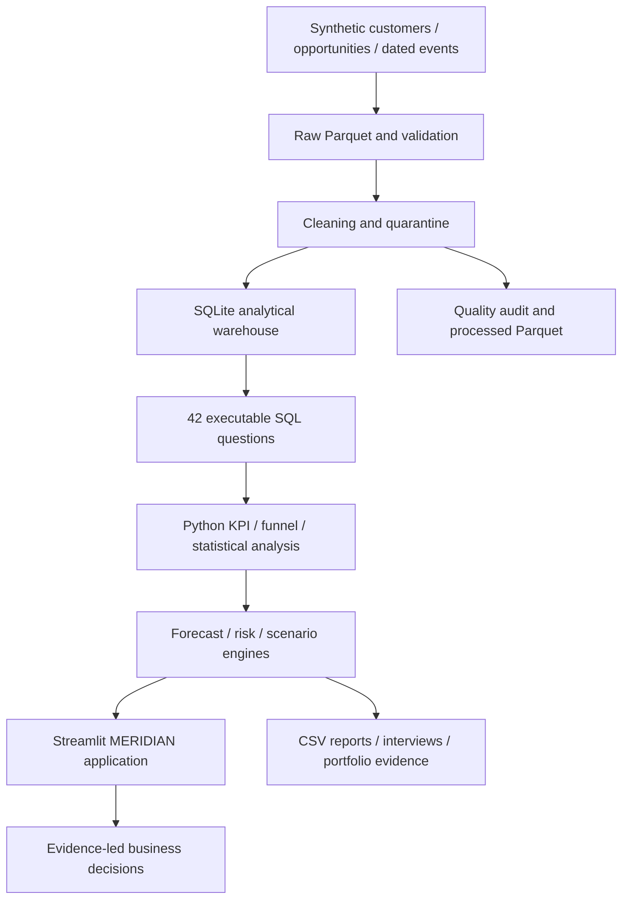

# Architecture

Physical execution calculates Python outputs before atomic database publication so all app tables appear together. SQL is then executed as a release gate against that complete warehouse. The diagram describes analytical responsibilities rather than separate services.

Customer 1→many Opportunities; Rep 1→many Opportunities; Team 1→many Reps; Product 1→many Opportunities; Opportunity 1→many Activities and Stage Visits; won Opportunity 1→1 Contract; Rep 1→many Monthly Targets. Region and industry are conformed descriptive attributes. Accounts map one-to-one to customers in this version.
