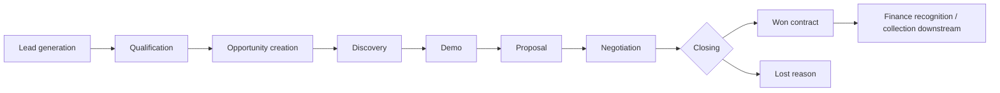

# As-is process — simulated discovery

These are hypothesized process problems used to frame requirements, not findings from real interviews. Qualification criteria vary between reps; stage dates are overwritten in spreadsheets; a proposal can remain open without a next action; managers aggregate gross values as if all will close; finance and sales use different definitions of revenue. Ownership transfers at proposal approval and finance handoff are unclear.

The analytical dataset measures stage duration, observed exits, activity recency and lost reasons to test those hypotheses within the simulation. The application ends at net contract bookings. Accounting recognition and collection are explicitly outside its modeled process.

Proposed discovery activities for a real company: interview sales and finance separately, walk through five won and five lost deals, inspect CRM field definitions, reconcile a month of closed deals, and agree definitions before choosing a model. No such interviews are claimed here.
