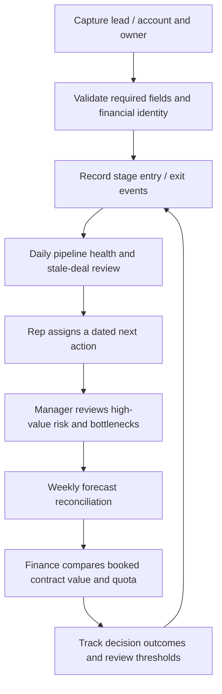

# To-be process

Stage exit criteria: Lead requires an identified business contact; Qualified requires fit and a plausible need; Discovery requires the problem and decision makers; Demo records evaluated capability; Proposal requires scope and commercial terms; Negotiation requires approval/procurement milestones; Closed Won requires contract confirmation; Closed Lost requires a reason.

The product provides monitoring, explanations and exports. A real CRM would execute next-action assignment and manager sign-off; the local app deliberately remains read-only. Weekly reviews should distinguish commit from broader pipeline and reconcile scenario assumptions with representative capacity. Finance retains ownership of recognized revenue and cash.

Success measures for a real pilot: stale share, missing-next-action share, stage-duration distribution, date slippage, forecast WAPE and booking target gap. Establish a baseline and measure after implementation, controlling for deal mix. No recovered-revenue result is claimed.
